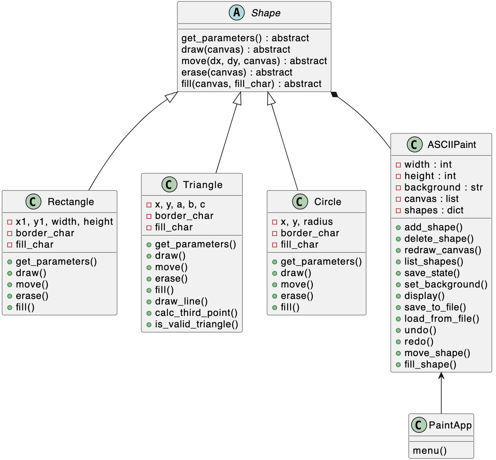

# ConsolePaint
Simple Paint app by Darya Stasiuk from group 353505
# UI description
The UI includes a canvas (width = 100, height = 20) with a frame and a drop-down menu where you can select one of the suggested commands. 
```
+----------------------------------------------------------------------------------------------------+
|                                                                                                    |
|                                                                                                    |
|                                                                                                    |
|                                                                                                    |
|                                                                                                    |
|                                                                                                    |
|                                                                                                    |
|                                                                                                    |
|                                                                                                    |
|                                                                                                    |
|                                                                                                    |
|                                                                                                    |
|                                                                                                    |
|                                                                                                    |
|                                                                                                    |
|                                                                                                    |
|                                                                                                    |
|                                                                                                    |
|                                                                                                    |
|                                                                                                    |
+----------------------------------------------------------------------------------------------------+

ASCII Paint Menu:
1. Draw a rectangle
2. Draw a triangle
3. Draw a circle
4. Fill a shape
5. Set background character
6. Save to file
7. Load from file
8. Move shape
9. Delete shape
10. List of shapes
11. Undo
12. Redo
13. Exit
Enter your choice:
```
#  Functions
## draw
**Rectangle** 
```
+----------------------------------------------------------------------------------------------------+
|                                                                                                    |
|                                                                                                    |
|                                                                                                    |
|                                                                                                    |
|                                                                                                    |
|                                                                                                    |
|                                                                                                    |
|                                                                                                    |
|                                                                                                    |
|                                                                                                    |
|                                                                                                    |
|                                                                                                    |
|                                                                                                    |
|                                                                                                    |
|                                                                                                    |
|                                                                                                    |
|                                                                                                    |
|                                                                                                    |
|                                                                                                    |
|                                                                                                    |
+----------------------------------------------------------------------------------------------------+

ASCII Paint Menu:
1. Draw a rectangle
2. Draw a triangle
3. Draw a circle
4. Fill a shape
5. Set background character
6. Save to file
7. Load from file
8. Move shape
9. Delete shape
10. List of shapes
11. Undo
12. Redo
13. Exit
Enter your choice: 1
Enter (x1, y1) coordinates and width and height: 25 5 10 15
Enter border character: *
Enter fill character (or leave blank): 
+----------------------------------------------------------------------------------------------------+
|                                                                                                    |
|                                                                                                    |
|                                                                                                    |
|                                                                                                    |
|                                                                                                    |
|                         **********                                                                 |
|                         *        *                                                                 |
|                         *        *                                                                 |
|                         *        *                                                                 |
|                         *        *                                                                 |
|                         *        *                                                                 |
|                         *        *                                                                 |
|                         *        *                                                                 |
|                         *        *                                                                 |
|                         *        *                                                                 |
|                         *        *                                                                 |
|                         *        *                                                                 |
|                         *        *                                                                 |
|                         *        *                                                                 |
|                         **********                                                                 |
+----------------------------------------------------------------------------------------------------+
```
**Triangle**
```
+----------------------------------------------------------------------------------------------------+
|                                                                                                    |
|                                                                                                    |
|                                                                                                    |
|                                                                                                    |
|                                                                                                    |
|                                                                                                    |
|                                                                                                    |
|                                                                                                    |
|                                                                                                    |
|                                                                                                    |
|                                                                                                    |
|                                                                                                    |
|                                                                                                    |
|                                                                                                    |
|                                                                                                    |
|                                                                                                    |
|                                                                                                    |
|                                                                                                    |
|                                                                                                    |
|                                                                                                    |
+----------------------------------------------------------------------------------------------------+

ASCII Paint Menu:
1. Draw a rectangle
2. Draw a triangle
3. Draw a circle
4. Fill a shape
5. Set background character
6. Save to file
7. Load from file
8. Move shape
9. Delete shape
10. List of shapes
11. Undo
12. Redo
13. Exit
Enter your choice: 2
Enter x y coordinates and a b c: 35 12 13 18 27
Enter character: .
+----------------------------------------------------------------------------------------------------+
|                                                                                                    |
|                                                                                                    |
|                                                                                                    |
|                                                                                                    |
|                                                                                                    |
|                                                  ..                                                |
|                                                .. .                                                |
|                                              ..  .                                                 |
|                                           ...    .                                                 |
|                                         ..      .                                                  |
|                                       ..        .                                                  |
|                                     ..         .                                                   |
|                                   ..............                                                   |
|                                                                                                    |
|                                                                                                    |
|                                                                                                    |
|                                                                                                    |
|                                                                                                    |
|                                                                                                    |
|                                                                                                    |
+----------------------------------------------------------------------------------------------------+
```
**Circle**
```
+----------------------------------------------------------------------------------------------------+
|                                                                                                    |
|                                                                                                    |
|                                                                                                    |
|                                                                                                    |
|                                                                                                    |
|                                                                                                    |
|                                                                                                    |
|                                                                                                    |
|                                                                                                    |
|                                                                                                    |
|                                                                                                    |
|                                                                                                    |
|                                                                                                    |
|                                                                                                    |
|                                                                                                    |
|                                                                                                    |
|                                                                                                    |
|                                                                                                    |
|                                                                                                    |
|                                                                                                    |
+----------------------------------------------------------------------------------------------------+

ASCII Paint Menu:
1. Draw a rectangle
2. Draw a triangle
3. Draw a circle
4. Fill a shape
5. Set background character
6. Save to file
7. Load from file
8. Move shape
9. Delete shape
10. List of shapes
11. Undo
12. Redo
13. Exit
Enter your choice: 3
Enter (x, y) coordinates and radius: 25 15 4
Enter border character: $
Enter fill character (or leave blank): 
+----------------------------------------------------------------------------------------------------+
|                                                                                                    |
|                                                                                                    |
|                                                                                                    |
|                                                                                                    |
|                                                                                                    |
|                                                                                                    |
|                                                                                                    |
|                                                                                                    |
|                                                                                                    |
|                                                                                                    |
|                                                                                                    |
|                         $                                                                          |
|                       $$ $$                                                                        |
|                      $     $                                                                       |
|                      $     $                                                                       |
|                     $       $                                                                      |
|                      $     $                                                                       |
|                      $     $                                                                       |
|                       $$ $$                                                                        |
|                         $                                                                          |
+----------------------------------------------------------------------------------------------------+
```
## fill_shape
```
Current Shapes on Canvas:
------------------------------------------------------
ID    Shape      Parameters
------------------------------------------------------
1     Rectangle  x1 = 55, y1 = 10, x2 = 69, y2 = 14, border = '-', fill = 'None'
------------------------------------------------------
Enter the ID of the shape to fill: 1
Enter fill character: +
Shape 1 filled successfully.
+----------------------------------------------------------------------------------------------------+
|                                                                                                    |
|                                                                                                    |
|                                                                                                    |
|                                                                                                    |
|                                                                                                    |
|                                                                                                    |
|                                                                                                    |
|                                                                                                    |
|                                                                                                    |
|                                                                                                    |
|                                                       ---------------                              |
|                                                       -+++++++++++++-                              |
|                                                       -+++++++++++++-                              |
|                                                       -+++++++++++++-                              |
|                                                       ---------------                              |
|                                                                                                    |
|                                                                                                    |
|                                                                                                    |
|                                                                                                    |
|                                                                                                    |
+----------------------------------------------------------------------------------------------------+
```
## set_background
Сhanges the background color
```
+----------------------------------------------------------------------------------------------------+
|                                                                                                    |
|                                                                                                    |
|                                                                                                    |
|                                                                                                    |
|                                                                                                    |
|                                                                                                    |
|                                                                                                    |
|                                                                                                    |
|                                                                                                    |
|                                                                                                    |
|                                                                                                    |
|                                                                                                    |
|                                                                                                    |
|                                                                                                    |
|                                                                                                    |
|                                                                                                    |
|                                                                                                    |
|                                                                                                    |
|                                                                                                    |
|                                                                                                    |
+----------------------------------------------------------------------------------------------------+

ASCII Paint Menu:
1. Draw a rectangle
2. Draw a triangle
3. Draw a circle
4. Fill a shape
5. Set background character
6. Save to file
7. Load from file
8. Move shape
9. Delete shape
10. List of shapes
11. Undo
12. Redo
13. Exit
Enter your choice: 5
Enter a single character for the background: .
+----------------------------------------------------------------------------------------------------+
|....................................................................................................|
|....................................................................................................|
|....................................................................................................|
|....................................................................................................|
|....................................................................................................|
|....................................................................................................|
|....................................................................................................|
|....................................................................................................|
|....................................................................................................|
|....................................................................................................|
|....................................................................................................|
|....................................................................................................|
|....................................................................................................|
|....................................................................................................|
|....................................................................................................|
|....................................................................................................|
|....................................................................................................|
|....................................................................................................|
|....................................................................................................|
|....................................................................................................|
+----------------------------------------------------------------------------------------------------+
```
## save_to_file
This function saves the current state of the object to a file
```
+----------------------------------------------------------------------------------------------------+
|....................................................................................................|
|....................................................................................................|
|....................................................................................................|
|....................................................................................................|
|....................................................................................................|
|....................................................................................................|
|....................................................................................................|
|....................................................................................................|
|....................................................................................................|
|....................................................................................................|
|....................................................................................................|
|....................................................................................................|
|....................................................................................................|
|....................................................................................................|
|....................................................................................................|
|....................................................................................................|
|....................................................................................................|
|....................................................................................................|
|....................................................................................................|
|....................................................................................................|
+----------------------------------------------------------------------------------------------------+

ASCII Paint Menu:
1. Draw a rectangle
2. Draw a triangle
3. Draw a circle
4. Fill a shape
5. Set background character
6. Save to file
7. Load from file
8. Move shape
9. Delete shape
10. List of shapes
11. Undo
12. Redo
13. Exit
Enter your choice: 6
Enter filename to save: 1.txt
```
Contents of file 1.txt:
```
....................................................................................................
....................................................................................................
....................................................................................................
....................................................................................................
....................................................................................................
....................................................................................................
....................................................................................................
....................................................................................................
....................................................................................................
....................................................................................................
....................................................................................................
....................................................................................................
....................................................................................................
....................................................................................................
....................................................................................................
....................................................................................................
....................................................................................................
....................................................................................................
....................................................................................................
....................................................................................................
```
## load_from_file
This function loads data from a file and restores the state of the object.
Contents of file 1.txt:
```
....................................................................................................
....................................................................................................
....................................................................................................
....................................................................................................
....................................................................................................
....................................................................................................
.............................................*......................................................
...........................................**.**....................................................
..........................................*.....*...................................................
..........................................*.....*...................................................
.........................$$$$$$$$$$......*.......*..................................................
.........................$$$$$$$$$$.......*.....*...................................................
.........................$$$$$$$$$$.......*.....*...................................................
.........................$$$$$$$$$$........**.**....................................................
.........................$$$$$$$$$$..........*......................................................
.........................$$$$$$$$$$.................................................................
.........................$$$$$$$$$$.................................................................
.........................$$$$$$$$$$.................................................................
.........................$$$$$$$$$$.................................................................
.........................$$$$$$$$$$.................................................................

```
```
Enter filename to load: 1.txt
Canvas loaded from '1.txt' successfully!
+----------------------------------------------------------------------------------------------------+
|....................................................................................................|
|....................................................................................................|
|....................................................................................................|
|....................................................................................................|
|....................................................................................................|
|....................................................................................................|
|.............................................*......................................................|
|...........................................**.**....................................................|
|..........................................*.....*...................................................|
|..........................................*.....*...................................................|
|.........................$$$$$$$$$$......*.......*..................................................|
|.........................$$$$$$$$$$.......*.....*...................................................|
|.........................$$$$$$$$$$.......*.....*...................................................|
|.........................$$$$$$$$$$........**.**....................................................|
|.........................$$$$$$$$$$..........*......................................................|
|.........................$$$$$$$$$$.................................................................|
|.........................$$$$$$$$$$.................................................................|
|.........................$$$$$$$$$$.................................................................|
|.........................$$$$$$$$$$.................................................................|
|.........................$$$$$$$$$$.................................................................|
+----------------------------------------------------------------------------------------------------+
```
## move_shape
```
Current Shapes on Canvas:
------------------------------------------------------
ID    Shape      Parameters
------------------------------------------------------
2     Circle     x = 4, y = 5, radius = 1, border_char = '#, fill_char ='None'
------------------------------------------------------
Enter the ID of the shape to move: 2
Enter the amount to move (dx dy): 5 0
Shape 2 moved successfully.
```
## delete_shape 
Deletes a figure by a given ID, displaying a list of figures before doing so
```
Current Shapes on Canvas:
------------------------------------------------------
ID    Shape      Parameters
------------------------------------------------------
1     Rectangle  x1 = 2, y1 = 3, x2 = 46, y2 = 4, border = '$', fill = '$'
2     Circle     x = 4, y = 5, radius = 1, border_char = '#, fill_char ='None'
------------------------------------------------------
Enter the ID of the shape to delete: 1
Shape 1 deleted successfully.
```
## list_shapes
It is possible to view the list of shapes, which contains the id, what shape (circle, rectangle or triangle) and their parameters (for example: radius, height, width, fill_char etc.)
```
Current Shapes on Canvas:
------------------------------------------------------
ID    Shape      Parameters
------------------------------------------------------
1     Rectangle  x1 = 2, y1 = 3, x2 = 46, y2 = 4, border = '$', fill = '$'
2     Circle     x = 4, y = 5, radius = 1, border_char = '#, fill_char ='None'
------------------------------------------------------
```
## undo
This function undoes the last change, returning the state of the object to the previous version.
## redo
This function redoes an undone action, restoring the object's state to the state that was undone.
# UML Diagramm
